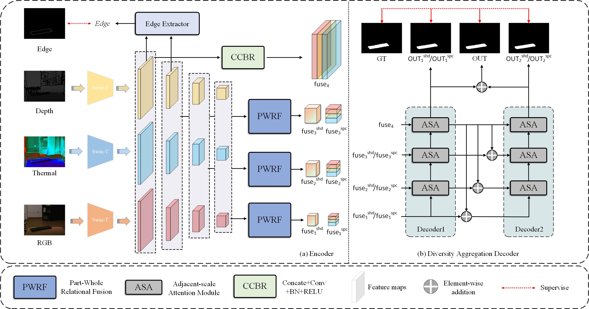

# DMTNet: A Disentangled Multimodal Transformer Network for V-D-T Salient Object Detection




## Requirements
python 3.9

pytorch 1.11.0

tensorboardX 2.5
## Results and Saliency maps
We provide [saliency maps](https://drive.google.com/file/d/1sC4FVbp4J536MNqO8KSD4Js4l5jNcPs7/view?usp=sharing) of our DMTNet on VDT dataset.
## Training
Please run 
```
python train.py
```
## Pre-trained model and testing
- Download the following pre-trained models ([Swin Transformer](https://github.com/SwinTransformer/storage/releases/download/v1.0.0/swin_base_patch4_window12_384_22k.pth)) and put them in /pretrain.
- Modify pathes of pre-trained models and datasets.
- Run 
```
python test.py
```
## Downloading Training and Testing Datasets:
- The VDT-2048 dataset and challenge in Test-set can be download [here](https://pan.baidu.com/s/1SJUWp_3pDbhcTW8ZOjYc8A ) (fetch code: lw6y)


